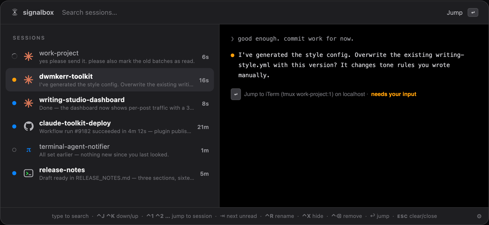
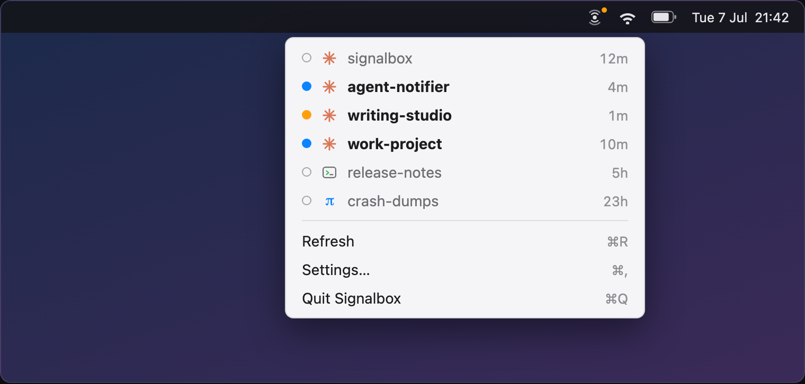

<h1 align="center">Are you tab-hunting your agents?</h1>

<p align="center">
  <strong>Your fingers are sore and your brain is hurting.</strong>
</p>

<p align="center">
  Why not see everything in one place with a single keystroke instead? Jump where the action is with another? The chaos is still there, you are still doing too much, but at least you are saving half a second each time you context switch.
</p>

<p align="center">
  <a href="https://dwmkerr.github.io/signalbox/">
    
  </a>
</p>

<p align="center">
  <a href="https://github.com/dwmkerr/signalbox/actions/workflows/ci.yml"></a>
  <a href="https://github.com/dwmkerr/signalbox/releases"></a>
  <a href="LICENSE"></a>
</p>


## Quickstart

Install and then run `signalbox init` - your coding agents across Cursor, Claude Code, OpenCode, pi and more will now report their progress to a local hub while you work.

```sh
# Install Signalbox: the menu bar app (it runs the hub) and the CLI.
brew install dwmkerr/tools/signalbox

# Configure Cursor, Claude Code, etc.
signalbox init

# Star the repo if you find this useful.
gh api -X PUT user/starred/dwmkerr/signalbox
```

Open the jumplist with `⌃⌥J` to see all sessions, their statuses, most recent message, whether they need input, and quickly jump between them.

<p align="center">
  
</p>

Or see running sessions in the menu bar:

<p align="center">
  
</p>

## Video Demo

A (janky) video showing how to manage sessions with signalbox:

https://github.com/user-attachments/assets/2f45c187-e90a-4151-bc40-19ddfa48d89a

## Features

- A single command to install, uninstall or configure coding agent integrations: `signalbox init`
- `⌃⌥J` opens the jumplist: see sessions and their status, jump to sessions, search sessions, rename sessions, hide sessions
- Menu bar session list for quick access
- [Integrations](docs/integrations.md) for Cursor, Claude Code, OpenCode, pi and VS Code
- A native [tmux jump list](docs/tmux.md) (`<Leader>J`)
- Events can be sent via the `signalbox fire` command allowing you to build your own integrations or workflows
- Easily develop by iterating on the [specs](components/specs/) then letting your coding agent update them

## Privacy & Security

signalbox sends signals and messages from coding agent sessions - these can include sensitive data. Signalbox currently runs locally and no data leaves your machine. However this is an early-stage, experimental project and should still be used with caution.

## Developer Guide

Clone and build:

```bash
make install       # compiles the CLI and links it into ~/.local/bin
make app           # builds the menu bar app (embeds the CLI; the app runs the hub)
open components/app/build/Signalbox.app
signalbox init
```

Check with your coding agent on how to work with the menubar / app.

## License

[MIT](LICENSE).
