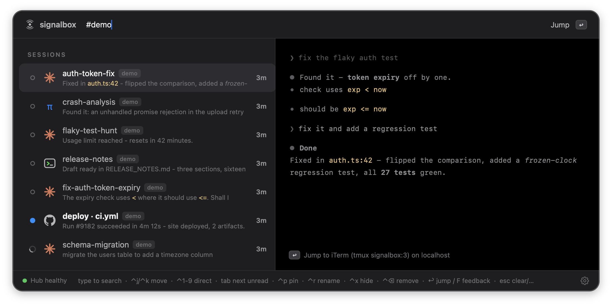
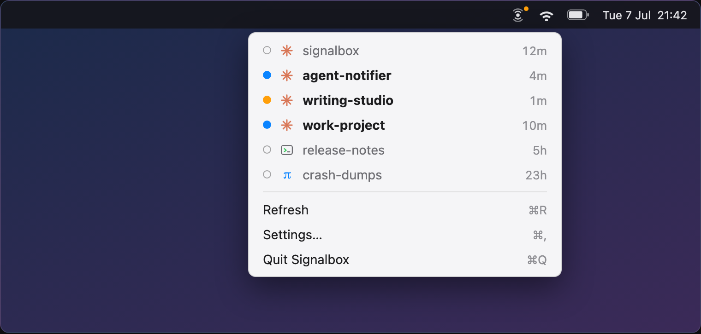
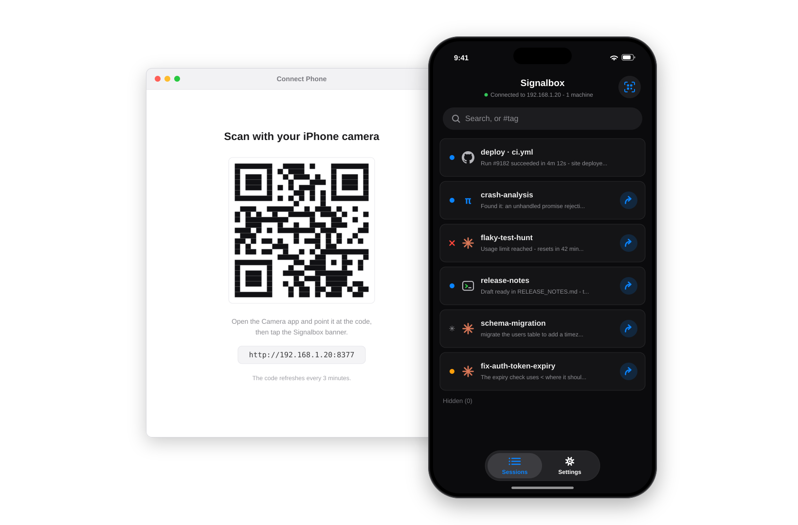
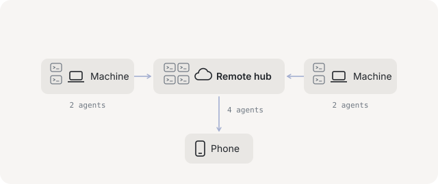

<h1 align="center">Are you tab-hunting your agents?</h1>

<p align="center">
  <strong>Your fingers are sore and your brain is hurting.</strong>
</p>

<p align="center">
  Why not see everything in one place with a single keystroke instead? Jump where the action is with another? The chaos is still there, you are still doing too much, but at least you are saving half a second each time you context switch.
</p>

<p align="center">
  <a href="https://dwmkerr.github.io/signalbox/">
    
  </a>
</p>

<p align="center">
  <a href="https://github.com/dwmkerr/signalbox/actions/workflows/ci.yml"></a>
  <a href="https://github.com/dwmkerr/signalbox/releases"></a>
  <a href="LICENSE"></a>
</p>


## Quickstart

Install and then run `signalbox init` - your coding agents across Cursor, Claude Code, Codex, OpenCode, pi and more will now report their progress to a local hub while you work.

```sh
# Install Signalbox: the menu bar app (it runs the hub) and the CLI.
brew install dwmkerr/tools/signalbox

# Configure Cursor, Claude Code, etc.
signalbox init

# Star the repo if you find this useful.
gh api -X PUT user/starred/dwmkerr/signalbox
```

**iPhone (alpha):** watch your board from your phone - [join the TestFlight beta](https://testflight.apple.com/join/umJpETbZ), then pair by scanning the QR from **Connect Phone** in the menu bar app.

Open the jumplist with `⌃⌥J` to see all sessions, their statuses, most recent message, whether they need input, and quickly jump between them.

<p align="center">
  
</p>

Or see running sessions in the menu bar:

<p align="center">
  
</p>

## On your phone

Pair with a QR code and use the mobile app to see your sessions on your phone.

<p align="center">
  
</p>

While the Apple App Store review is ongoing, you can build the app locally to test it - see the [Developer Guide](#developer-guide) below.

<!-- TODO(dave): next pass -
  - [ ] Verify the interactive `signalbox init` end to end (config-editing + honest states).
  - [ ] Codex: promote from "still in testing" to Stable in docs/integrations.md once bedded in.
  - [ ] Hero/landing animation: add a mobile visual when there's a good frame for it.
-->

## Video Demo

A (janky) video showing how to manage sessions with signalbox:

https://github.com/user-attachments/assets/2f45c187-e90a-4151-bc40-19ddfa48d89a

## Running a remote hub

To connect your phone over the internet, or forward events from multiple machines to one board, run a [remote hub](docs/remote-hub.md).



As an example, deploying to [fly.io](https://fly.io) from the repository root:

```bash
# Create the fly app, but don't deploy until the volume and token exist.
fly launch --no-deploy -c components/deploy/fly/fly.toml

# Create a volume for the event log, in the region you picked.
fly volumes create signalbox_data -s 1 -r <region> -c components/deploy/fly/fly.toml

# Create a token, store it as a secret, then deploy.
export SIGNALBOX_TOKEN="$(openssl rand -base64 24)"
fly secrets set SIGNALBOX_TOKEN="$SIGNALBOX_TOKEN" -c components/deploy/fly/fly.toml
fly deploy -c components/deploy/fly/fly.toml --dockerfile components/deploy/Dockerfile --ha=false .
```

Then open 'Settings > Hub', choose 'Mode: Remote', enter the hub URL and token, then 'Test' and 'Confirm'. Or from the CLI:

```bash
# Point the local hub at the remote hub and store the token.
signalbox config set hub.upstream https://<app>.fly.dev
signalbox config set hub.token "$SIGNALBOX_TOKEN"
```

The [remote hub guide](docs/remote-hub.md) has the details.

## Features

- A single command to install, uninstall or configure coding agent integrations: `signalbox init`
- `⌃⌥J` opens the jumplist: see sessions and their status, jump to sessions, search sessions, rename sessions, hide sessions
- Menu bar session list for quick access
- [Integrations](docs/integrations.md) for Cursor, Claude Code, Codex, OpenCode, pi and VS Code
- Run a [remote hub](docs/remote-hub.md) to forward events from multiple machines and connect your phone over the internet
- A native [tmux jump list](docs/tmux.md) (`<Leader>J`)
- Events can be sent via the `signalbox fire` command allowing you to build your own integrations or workflows
- Easily develop by iterating on the [specs](components/specs/) then letting your coding agent update them

## Privacy & Security

signalbox sends signals and messages from coding agent sessions - these can include sensitive data. In Local mode no data leaves localhost. In LAN mode events are accessible to machines on the same local network. Remote mode forwards events to a remote host and should be used with caution. This is an early-stage, experimental project.

## Developer Guide

Clone and build:

```bash
make install       # compiles the CLI and links it into ~/.local/bin
make app           # builds the menu bar app (embeds the CLI; the app runs the hub)
open components/app/build/Signalbox.app
signalbox init
```

Build and run the iOS app (in testing while App Store review is ongoing):

```bash
open components/ios/Signalbox.xcodeproj
# pick a simulator or your iPhone in Xcode and press Run
# (a device build needs your signing team under Signing & Capabilities)
```

On the simulator the app connects to your Mac's hub automatically. On a real device, pair with a QR code: run `signalbox pair` (or choose "Connect Phone" in the menu bar app) and scan it from Settings > Scan to Connect. The full guide - command-line builds, device signing, dev hooks - is [Building the mobile app](docs/mobile.md); the UI spec is [ios.html](components/specs/ios.html).

Check with your coding agent on how to work with the menubar / app.

## Troubleshooting

- The app-spawned hub logs to `~/.local/state/signalbox/hub.log` (view it in 'Settings > Logs') - start there when the board looks wrong.
- Remote hub issues: see [troubleshooting](docs/remote-hub.md#troubleshooting) in the remote hub guide.

## License

[MIT](LICENSE).
